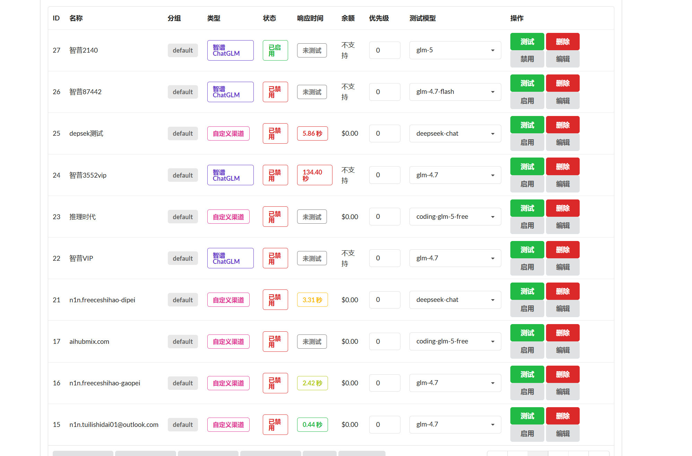
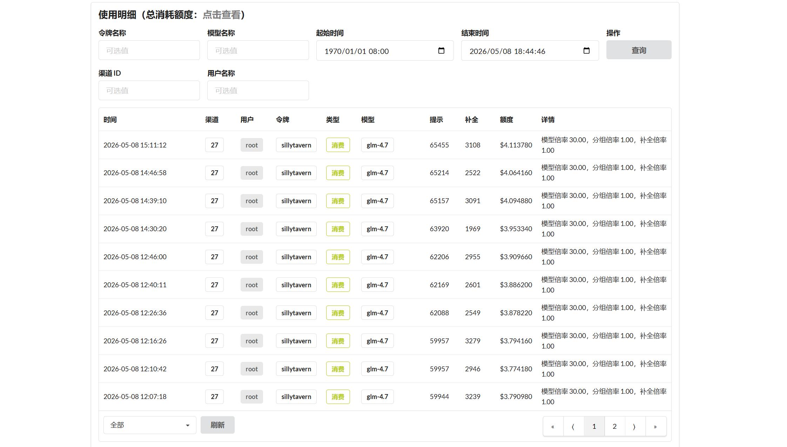
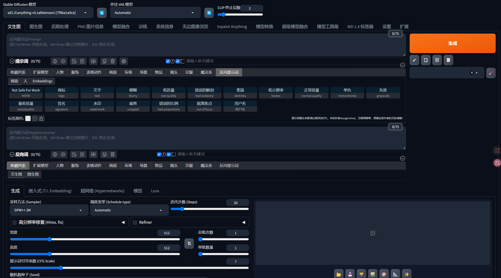

# 👋 你好，我是 Neike — AI 应用工程师

> **多模型 API 集成 · Token 成本控制 · 提示词降本增效**

---

### 🔗 [🚀 立即访问我的在线作品站](https://neike.github.io)

---

### 📸 项目预览

---

### 💡 在这里你能看到
- **API 智能调度**：多 Key 轮询、超额自动切换备用通道
- **Token 成本控制**：实时监控 + 提示词优化，降低约 30% 消耗
- **流式对话体验**：上下文管理的 SSE 流式输出
- **工具型/情感型提示词调优**：基于 SillyTavern 的角色构建

---

### 🧰 技术栈
`Python` `FastAPI` `asyncio` `Ollama` `OpenAI API` `Claude API` `SQLite` `Git`

---

### 📄 简历下载
[点击下载我的简历 PDF](简历.pdf) 

---

_本仓库同时部署为 GitHub Pages，欢迎直接访问上方链接查看完整交互效果。_
